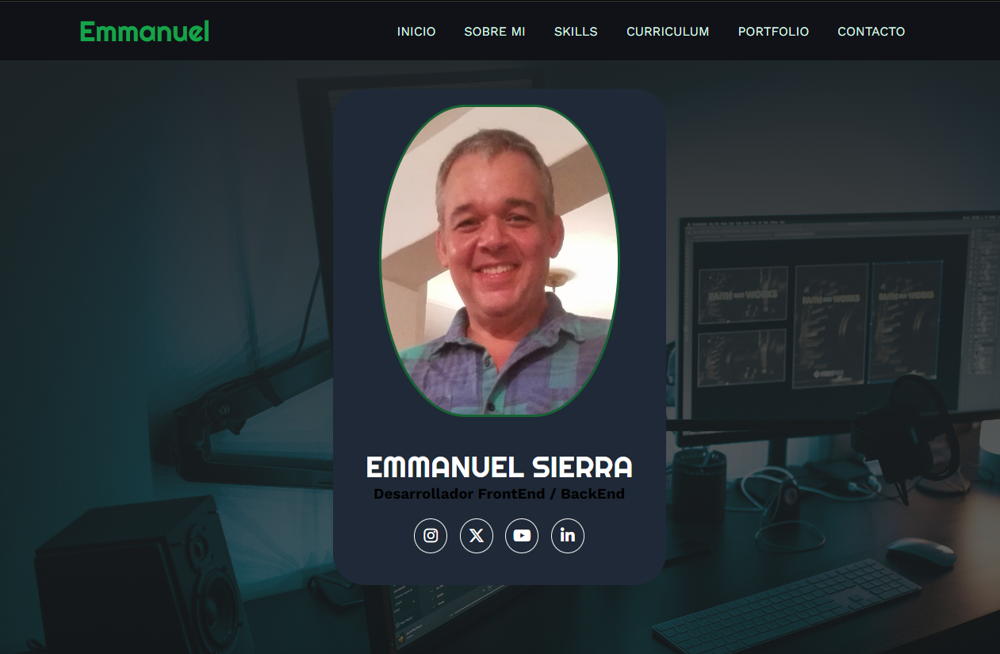
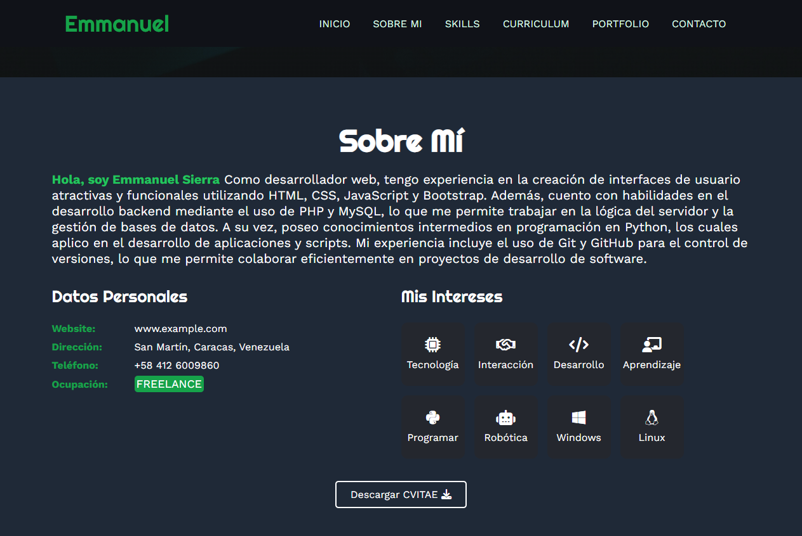

# PORTAFOLIO v1

<h2>
    Portafolio responsive relaborado con HTML, CSS, JAVASCRIPT 🚀
</h2>

### Pantallas de la WEB

    

    

### Especificaciones:
* Debe descargar todo el proyecto
* Colocarlo en su carpeta 
### Estatus actual: Terminado (Marzo 2024)